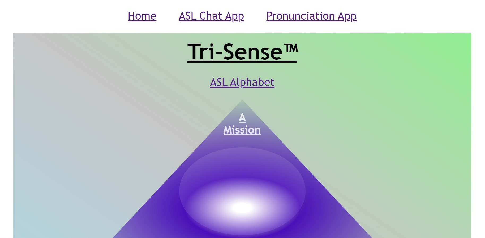

# Tri-Sense

1st level project(MVP): A dictionary look up app with returning word, pronunciation(written form), part of speach, and vocal file giving auditory example of pronunciation.
 
2nd level project(stretch goals) - Detect hand position and show constant stream live through webcam incorporating another technology, MediaPipe hand tracking, properly through react. Make that functionality capable of being activated or deactivated via client. This creates the foundation for myself and other programmers to build applications using these combined technologies.
 
3rd level project(serious stretch goals)- relate live to American Sign Language alphabet, pull words from Merriam-Webster's Dictionary API and provide functionality to sign our words returned as audio and text (can scale back to written input only to still provide viable 1st level product(MVP) within the limited timeframe).
## User-Story
**Used primarily by**: 
Developers and any client who is hard of hearing; I want to type out and sign out my words converted to sounds and written form so that I can more efficiently communicate with all other people in a multitude of situations.  
**End user goal**: 
App for creating sign language interpretation by camera and returned as written and vocalized characters.   
**End business goal**:  Camera access. Merriam-Webster's Dictionary API.  
**Acceptance criteria**:  Track hand motion and nuances. Refer to American Sign Language Alphabet. Refer to Merriam-Webster's API. Return written characters. Return vocal versions of signed characters.  

*Level One project (MVP) and Level Two project (strech goal) achieved. All acceptance criteria achieved.

Sources: 
MediaPipe documentation and code boilerplate: https://google.github.io/mediapipe/getting_started/javascript.html
General connecting webcam to browser capability: https://www.kirupa.com/html5/accessing_your_webcam_in_html5.htm
General create files via javascript: https://code-boxx.com/create-save-files-javascript/
LabelBox for image annotation to use in training and testing cases: https://app.labelbox.com/